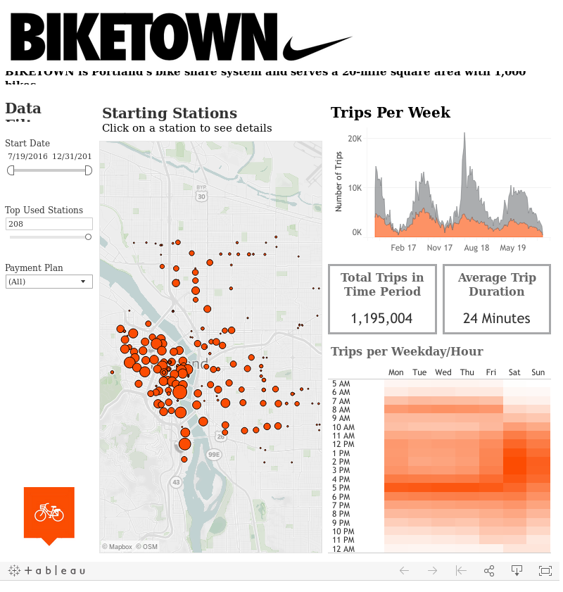

# Biketown bikeshare data

Contains ridership data for Portland's [Biketown](https://www.biketownpdx.com/) bikeshare program,
from 2016-2019,
including start and end lat/long, distance, duration, and plan (casual or subscription).
The dataset includes 128,262 rides.

Here's a screen shot of their data page:



# Data:

The data files are `.csv.gz`, which can be read directly into R using `read.csv(.., header=TRUE)`.

Obtained from https://www.biketownpdx.com/system-data on 7 March 2020:

```
for y in 2016 2017 2018 2019
do
    for m in 01 02 03 04 05 06 07 08 09 10 11 12
    do
        FILE="${y}_${m}.csv"
        ( wget https://s3.amazonaws.com/biketown-tripdata-public/$FILE && gzip > ${FILE} ) || echo "$FILE not found by wget" 
    done
done

$ wc -l *.gz
    2469 2016_07.csv.gz
    5023 2016_08.csv.gz
    3759 2016_09.csv.gz
    1958 2016_10.csv.gz
    1774 2016_11.csv.gz
     847 2016_12.csv.gz
     712 2017_01.csv.gz
     951 2017_02.csv.gz
    1381 2017_03.csv.gz
    2034 2017_04.csv.gz
    3821 2017_05.csv.gz
    4181 2017_06.csv.gz
    5774 2017_07.csv.gz
    5093 2017_08.csv.gz
    3700 2017_09.csv.gz
    2816 2017_10.csv.gz
    1735 2017_11.csv.gz
    1371 2017_12.csv.gz
    1592 2018_01.csv.gz
    1560 2018_02.csv.gz
    2621 2018_03.csv.gz
    2747 2018_04.csv.gz
    8681 2018_05.csv.gz
    5906 2018_06.csv.gz
    6614 2018_07.csv.gz
    5818 2018_08.csv.gz
    4373 2018_09.csv.gz
    3419 2018_10.csv.gz
    2637 2018_11.csv.gz
    2002 2018_12.csv.gz
    2139 2019_01.csv.gz
    1602 2019_02.csv.gz
    3332 2019_03.csv.gz
    3657 2019_04.csv.gz
    5242 2019_05.csv.gz
    4882 2019_06.csv.gz
    5094 2019_07.csv.gz
    4983 2019_08.csv.gz
  128300 total

```
