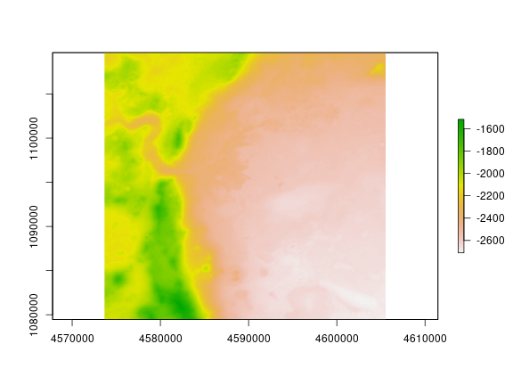

# Mars Jezero Crater Elevation

This is a spatial map of elevation (a Digital Terrain Model, DTM),
the "Mars 2020 Terrain Relative Navigation CTX DTM Mosaic",
described at [https://doi.org/10.5066/P906QQT8](https://doi.org/10.5066/P906QQT8) as:

> The Mars 2020 rover will explore Jezero crater, Mars to investigate an
> ancient delta for evidence of past microbial life and to better understand the
> geologic history of the region. The landing system onboard Mars 2020 will use
> technology developed at the Jet Propulsion Laboratory (JPL) called Terrain
> Relative Navigation (TRN), which will enable the spacecraft to autonomously
> avoid hazards (e.g., rock fields, crater rims) that exceed the safety
> requirements of the landing system. This capability allows small-scale hazards
> to be present in the landing ellipse, providing greater flexibility in
> selecting a landing location. In support of TRN, the USGS Astrogeology Science
> Center has generated and delivered the Lander Vision System (LVS) map generated
> from three Context Camera (CTX) orthorectified images that will be onboard the
> spacecraft and will be the "truth" dataset that TRN will use to orient itself
> relative to the surface during Entry, Decent, and Landing.This mosaic is
> available on this site, along with the individual CTX DTM images that make up
> the mosaic and the CTX orthomosaic and orthorectified images that were derived
> from this DTM.

**Files:** downloaded from [https://planetarymaps.usgs.gov/mosaic/mars2020_trn/CTX/](https://planetarymaps.usgs.gov/mosaic/mars2020_trn/CTX/)
on 2 March 2021:

- [JEZ_ctx_B_soc_008_DTM_MOLAtopography_DeltaGeoid_20m_Eqc_latTs0_lon0.tif](JEZ_ctx_B_soc_008_DTM_MOLAtopography_DeltaGeoid_20m_Eqc_latTs0_lon0.tif): the geospatial TIFF
- [JEZ_ctx_B_soc_008_orthoMosaic_6m_Eqc_latTs0_lon0.lbl](JEZ_ctx_B_soc_008_orthoMosaic_6m_Eqc_latTs0_lon0.lbl): a metadata file

Here's the image:


Example:
```r
library(raster)
jez <- raster("JEZ_ctx_B_soc_008_DTM_MOLAtopography_DeltaGeoid_20m_Eqc_latTs0_lon0.tif")

# make the image above
png("JEZ.png", width=72*8, height=72*6, res=72)
    plot(jez)
dev.off()

# extract elevations at a set of points
library(sp)
coords <- cbind(runif(10, min=bbox(jez)[1,1], max=bbox(jez)[1,2]),
                runif(10, min=bbox(jez)[2,1], max=bbox(jez)[2,2])))
sample_points <- SpatialPoints(coords)
sample_elevations <- extract(jez, sample_points)
```

